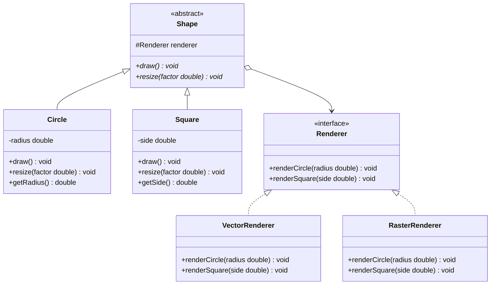

# Bridge Pattern Implementation - Shapes and Renderers
## Project Overview
This project demonstrates the Bridge Design Pattern by implementing geometric shapes that can be rendered using different rendering technologies. The pattern decouples abstraction (shapes) from implementation (renderers), allowing them to vary independently.

## Clean Code Principles
### Meaningful Naming
- Clear, descriptive method and variable names
- Specific, meaningful field names
- Consistent naming conventions throughout the codebase

### Single Responsibility Principle
- Shape hierarchy handles geometric properties and operations
- Renderer hierarchy handles rendering logic only
- Each class has one clear, focused responsibility

## Pattern Benefits
### Decoupling
- Shapes and renderers can evolve independently
- Changes in rendering technology don't affect shape logic
- Reduced dependencies between components
### Extensibility
- Easy to add new shapes without affecting renderers
- Easy to add new renderers without affecting shapes
- Modular architecture supports growth
### Runtime Flexibility
- Can switch renderers at runtime
- Dynamic behavior changes without recompilation
- Flexible configuration options
### Clean Architecture
- Clear separation of concerns
- Easy to test components in isolation
- Maintainable and readable code
- Better code organization
## Extension Possibilities

### New Shapes

- Triangle with base and height properties
- Rectangle with width and height properties
- Ellipse with major and minor axis
- Custom polygon shapes

### New Renderers

- SVGRenderer for vector graphics export
- PDFRenderer for document generation
- OpenGLRenderer for 3D rendering
- WebRenderer for browser-based display
### Enhanced Features

- 3D shapes and renderers
- Animation support with keyframes
- Color and texture management
- Export capabilities to various formats
- Interactive rendering options

## UML Diagram

## Conclusion 
This project successfully demonstrates the practical application of the Bridge pattern in Java, providing a clear separation between abstraction (shapes) and implementation (renderers). The implementation follows clean code principles, including meaningful naming, single responsibility, and composition over inheritance. The architecture allows independent extension of shape and renderer hierarchies, ensuring flexibility and maintainability. The project serves as a quality example of applying object-oriented principles and design patterns to create scalable and easily testable solutions.
