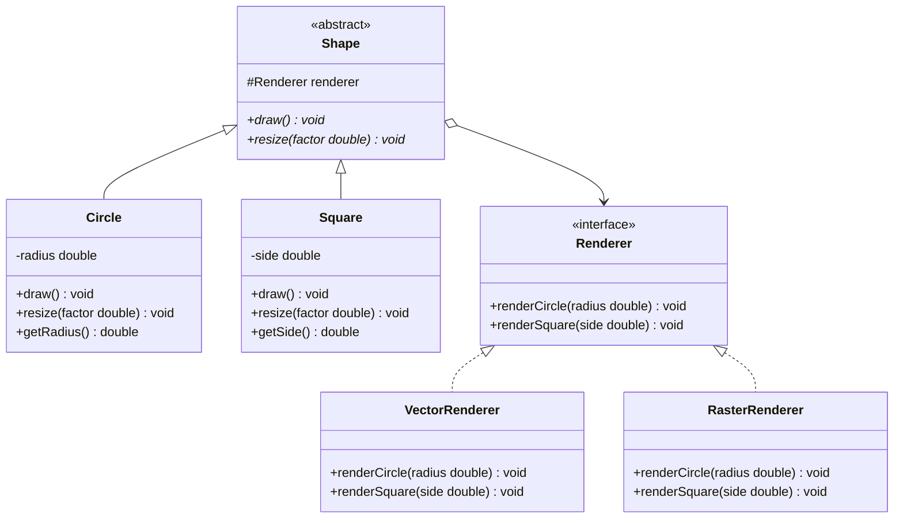

# UML Diagram

```mermaid
classDiagram
    class Shape {
        <<abstract>>
        #Renderer renderer
        +draw()* void
        +resize(factor double)* void
    }

    class Circle {
        -radius double
        +draw() void
        +resize(factor double) void
        +getRadius() double
    }

    class Square {
        -side double
        +draw() void
        +resize(factor double) void
        +getSide() double
    }

    class Renderer {
        <<interface>>
        +renderCircle(radius double) void
        +renderSquare(side double) void
    }

    class VectorRenderer {
        +renderCircle(radius double) void
        +renderSquare(side double) void
    }

    class RasterRenderer {
        +renderCircle(radius double) void
        +renderSquare(side double) void
    }

    Shape <|-- Circle
    Shape <|-- Square
    Shape o--> Renderer
    Renderer <|.. VectorRenderer
    Renderer <|.. RasterRenderer
```